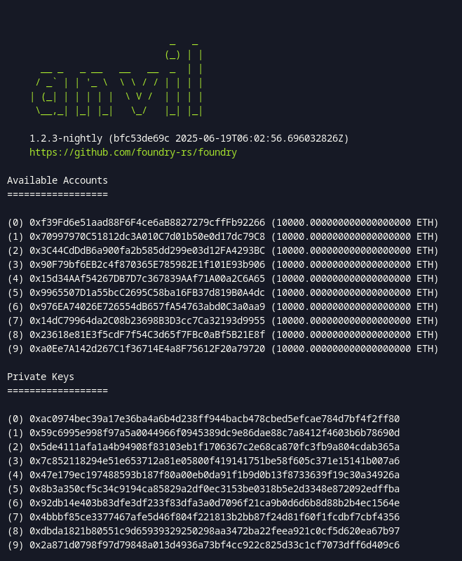
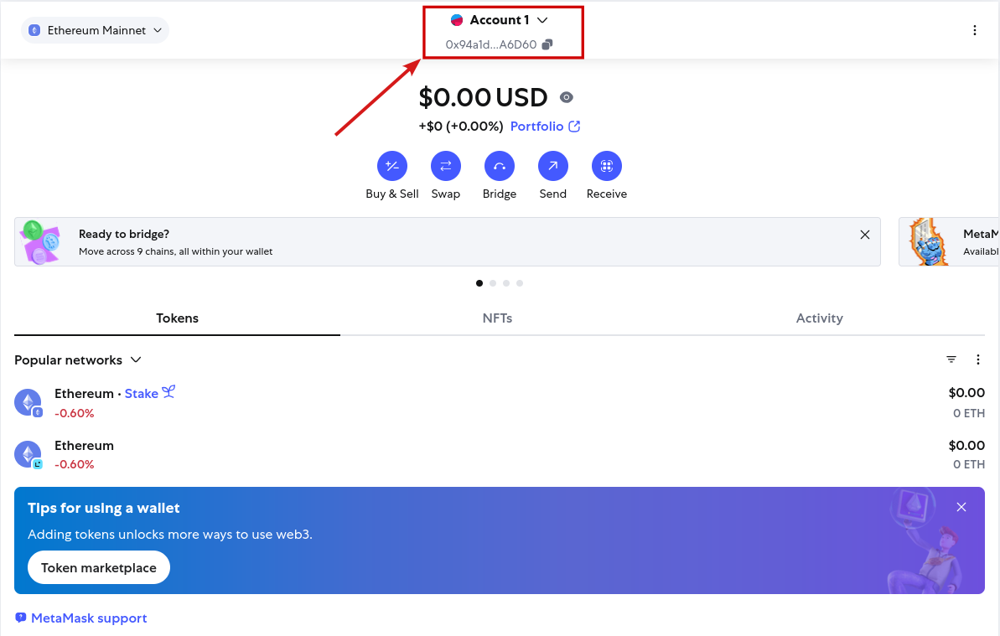
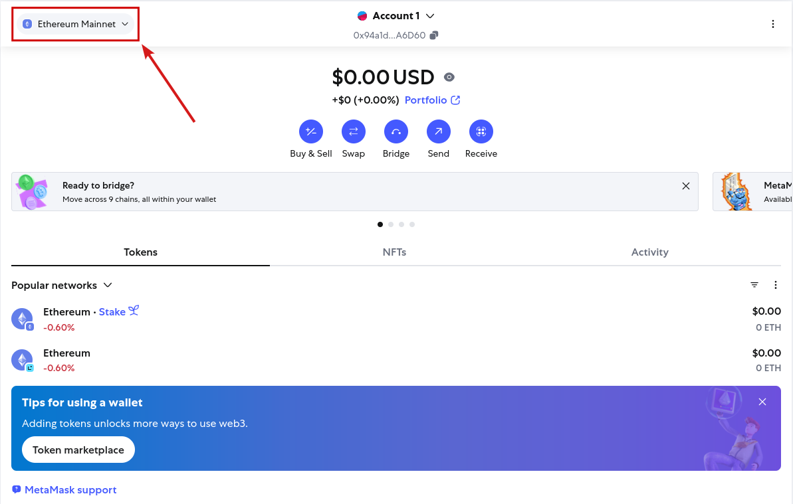
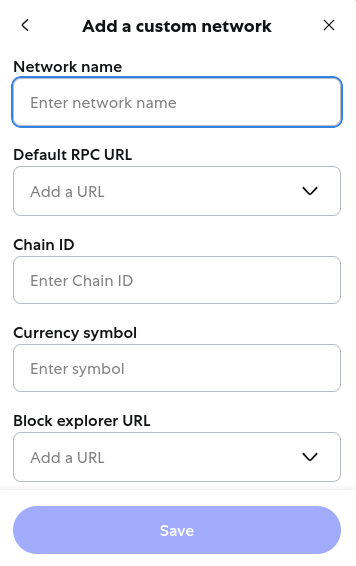

# How to Set Up MetaMask

We are using [MetaMask](https://github.com/metamask) for connecting our wallet and managing transactions. You can alternatively use the browser extension [MetaMask Extension](https://github.com/MetaMask/metamask-extension) for comfort.

### 1. Installation 

You can install MetaMask from your browser’s extension store (recommended), or from the [MetaMask GitHub repositories](#metamask-resources).

### 2. Create a new wallet

The first time you register, you will need to create a new wallet. When creating a wallet, MetaMask will show you a 12-word *Secret Recovery Phrase*. This is mandatory.
⚠️ If you plan to use this wallet only for local development, you may choose not to back it up — but be aware that losing the phrase means you *cannot recover your wallet*.

### 3. Add the Anvil Custom Network

You must start the local Anvil blockchain before adding the custom network in `MetaMask`. Otherwise, MetaMask will fail to connect or resolve the chain ID. If you're unsure how to start the local blockchain, follow the [QryptoRand Guide](contracts/lib/QryptoRand/README.md).

Once the blockchain is initialized, you will see something like this:

<i>Initialization of the blockchain.</i>

Save one of the `Private Keys` displayed in the Anvil terminal. You will use it to import an account into `MetaMask`.

Then import an account using the `Private Key`. Click on the account on the top.

<i>Adding a new account.</i>

And `Add account or hardware wallet` using the `Private Key`.

After this, we need to connect to the `anvil` network. Click on the network on the top left.

<i>Adding a new network.</i>

 

On the `Add a custom network` button and fill all the required fields.
  
> Network name= *`anvil`* \
> Default RPC URL = *`http://127.0.0.1:8545`* -> found in [.env.example](contracts/lib/QryptoRand/.env.example)\
> Chain ID= *`31337`* \
> Currency symbol= *`ETH`*

<i>Settings of the network.</i>

Finally, switch to the correct account and network and you should see that the account is filled with `$38,097,600.00USD = 10 000 Tokens`

These tokens do not have any real value.

## Troubleshooting

MetaMask can sometimes encounter issues when connected to the local Anvil network. Common symptoms include:

- Transactions failing unexpectedly
- Incorrect or missing balances
- Inability to switch networks or accounts

If you run into these problems, try the following steps:

1. **Remove the Anvil network** from MetaMask.
2. **Recreate the network** using the instructions above.
3. **Disconnect and reconnect your account**.
4. **Clear MetaMask’s cached activity data**:
   - Open MetaMask.
   - Go to **Settings** → **Advanced**.
   - Click **Clear activity tab data**.

These steps usually resolve most local development issues with MetaMask and Anvil.

## MetaMask Resources

- [MetaMask](https://github.com/metamask)
- [MetaMask Extension](https://github.com/MetaMask/metamask-extension)